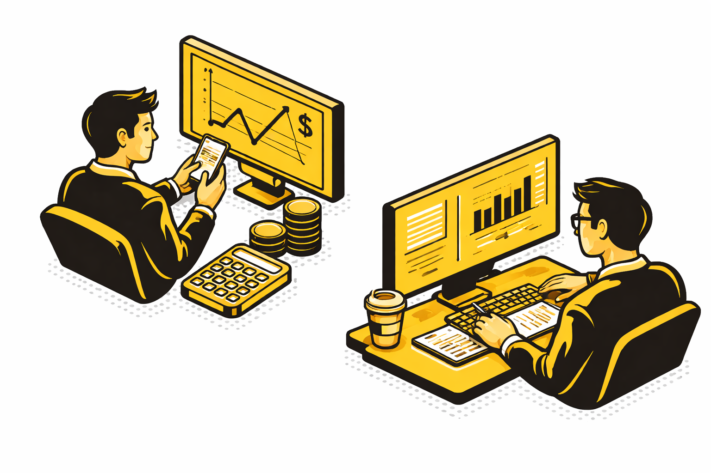

:::::{.columns}
::::{.column}
::::{.ddm}
:::{.ddm-head onclick="toggleBox(this)" style="text-align:left"}
**For individual investors**
:::
:::{.ddm-box}

- Keep all your investments in one place  
- Know exactly how your portfolio is performing  
- Spot winners and underperformers quickly  
- Turn complex data into simple, clear decisions  

:::
::::

::::{.ddm}
:::{.ddm-head onclick="toggleBox(this)" style="text-align:left"}
**For analysts and researchers**
:::
:::{.ddm-box}

- Skip data cleaning — start analyzing immediately  
- Work with clean, structured, reliable data  
- Compare companies and sectors with ease  
- Go from question to insight in minutes, not hours  

:::
::::

::::{.ddm}
:::{.ddm-head onclick="toggleBox(this)" style="text-align:left"}
**For traders and market explorers**
:::
:::{.ddm-box}

- Spot trends and market moves quickly  
- Understand price behavior at a glance  
- Explore ideas without complicated setup  
- React faster with clear, visual insights  
:::
::::

::::{.ddm}
:::{.ddm-head onclick="toggleBox(this)" style="text-align:left"}
**For data-driven thinkers**
:::
:::{.ddm-box}

- Discover patterns you might otherwise miss  
- Use built-in models or bring your own ideas  
- Turn raw data into meaningful signals  
- Make smarter decisions with less effort  
:::
::::

::::

::::{.column}
{width=600}
::::
:::::